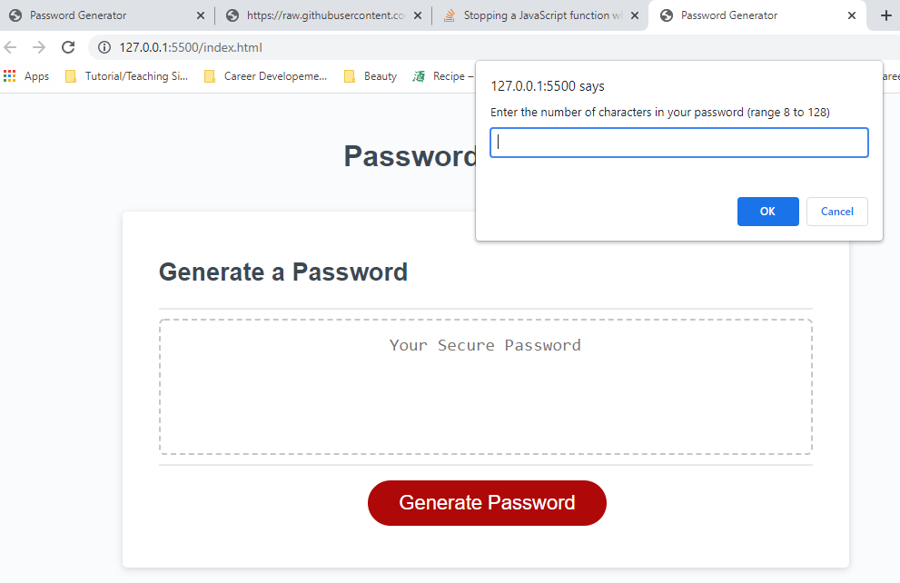

# 3-Password-Generator
## What this is
This is a javascript based passsword generation tool using a number of functions, methods, and other tools to generate a password that fit the user's needs

This is for 2-Password-Generator



## User Stor
```
AS AN employee with access to sensitive data
I WANT to randomly generate a password that meets certain criteria
SO THAT I can create a strong password that provides greater security
```

## Acceptance Criteria
```
GIVEN I need a new, secure password
WHEN I click the button to generate a password
THEN I am presented with a series of prompts for password criteria
WHEN prompted for password criteria
THEN I select which criteria to include in the password
WHEN prompted for the length of the password
THEN I choose a length of at least 8 characters and no more than 128 characters
WHEN asked for character types to include in the password
THEN I confirm whether or not to include lowercase, uppercase, numeric, and/or special characters
WHEN I answer each prompt
THEN my input should be validated and at least one character type should be selected
WHEN all prompts are answered
THEN a password is generated that matches the selected criteria
WHEN the password is generated
THEN the password is either displayed in an alert or written to the page
```

## Usage
Using the existing methods available with javasript, the user is prompted to provide the number of characters they require for their password. It is written in the form of a functions so that it can easily be called again. 
Once that is captured, the user provides what character types are needed for their password.
With the number of characters needed and the types needed, the password can be generated using the button on the screen (code already existed)

When creating the password and the funciton to put on the page, I made sure to use the appropriate var name. 


## Opportunities
An opportunity for the future is to allow the user to re-try within the run through if they provide a bad value (just allows the user know it was bad right now and allow to re-click the button)

I  left console.log for each function so that I can easily see what is executing and what the output is. If this were something to deliver for actual usage, I would remove those to make the code base cleaner.

## Credits
Referenced most of out in-class javascript practice
Referenced: https://www.coderrocketfuel.com/article/generate-a-random-letter-from-the-alphabet-using-javascript
